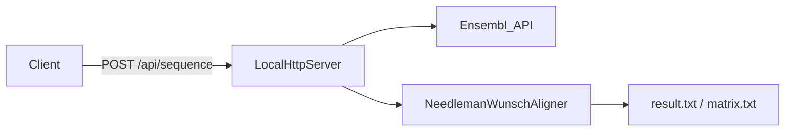

# nw-concurrency

A Java 23 project that implements **Needleman-Wunsch global sequence alignment** for DNA/RNA sequences. It supports configurable sequential or concurrent (ForkJoin) matrix computation, a decorator-based processing pipeline, and an optional HTTP workflow that fetches sequences from the [Ensembl REST API](https://rest.ensembl.org/).

## Quick overview



On each HTTP request, the server fetches two sequences by Ensembl gene ID, computes an optimal global alignment, and writes the result to a file or the console.

## Modules

| Module | Role |
|--------|------|
| **CommonProperties** | Loads `application.properties` and `request.properties` |
| **NeedlemanWunschAligner** | Algorithm, decorator pipeline, concurrency, printers |
| **WebRequest** | Ensembl HTTP client and local HTTP server |
| **NeedlemanOrchestrator** | Application entry point (executable JAR) |

See [docs/architecture.md](docs/architecture.md) for module dependencies, design patterns, and detailed diagrams.

## Documentation

| Document | Description |
|----------|-------------|
| [Architecture](docs/architecture.md) | Modules, request flow, decorator pipeline, class diagram |
| [Algorithm](docs/algorithm.md) | Needleman-Wunsch steps, scoring, worked example |
| [Concurrency](docs/concurrency.md) | ForkJoin matrix fill and parallel HTTP fetch |
| [API](docs/api.md) | HTTP endpoint contract and Ensembl integration |
| [Configuration](docs/configuration.md) | Full property reference and defaults |

## Environment

JDK: **23**

## Quick start

1. Build `NeedlemanOrchestrator.jar` via IntelliJ (see [Compiling instructions](#compiling-instructions) below).
2. Place `application.properties` and `request.properties` next to the JAR (see [Configuration](docs/configuration.md) for samples).
3. Run:

```bash
java -jar NeedlemanOrchestrator.jar
```

4. Send a POST request:

```bash
curl -X POST http://localhost:8080/api/sequence
```

## Output

| File | When | Contents |
|------|------|----------|
| `result.txt` | `backtracker.printer.enabled=true` (default) | Globally aligned sequences with `_` gap characters |
| `matrix.txt` | `matrix.printer.enabled=true` | Full scoring matrix |

## Application properties

All properties are optional and have defaults. See [docs/configuration.md](docs/configuration.md) for the full reference.

### Sample `application.properties`

Create a file named **application.properties** in the same directory as the compiled JAR (or `out/production/` when running from the IDE):

```properties
backtracker.printer.enabled=true
backtracker.printer.output=FILE
backtracker.printer.filename=result.txt
matrix.printer.enabled=false
matrix.printer.output=FILE
matrix.printer.filename=matrix.txt
matrix.concurrency.enabled=true
# matrix.concurrency.pool-size=2
matrix.concurrency.seq-threshold=20
matrix.score.gap=-2
matrix.score.match=1
matrix.score.miss=-1
matrix.log-exec-time=true
```

Note: `matrix.concurrency.pool-size` defaults to the number of available processors.

### Sample `request.properties`

Create a file named **request.properties** in the same directory as the JAR:

```properties
req.url=https://rest.ensembl.org/sequence/id/%s?type=cdna;content-type=application/json
req.seq-a-id=ENSG00000239615
req.seq-b-id=ENSG00000239617
```

Other sample sequences can be obtained from:

```
https://rest.ensembl.org/xrefs/symbol/homo_sapiens/VEGFA?content-type=application/json
[
    {
        "type": "gene",
        "id": "ENSG00000112715"
    }
]

https://rest.ensembl.org/lookup/id/ENSG00000112715?expand=1;content-type=application/json
// Look for protein_coding biotype
```

## Compiling instructions

To compile this project using IntelliJ IDEA:

**Step 1: Create a New Artifact**

1. Open your project in IntelliJ IDEA.
2. Go to File > Project Structure.
3. Select Artifacts in the left panel.
4. Click the + button and choose JAR > From modules with dependencies.
5. Choose the Main Class and select the modules you want to include.
6. Make sure that the "Include in project build" checkbox is checked.
7. Click OK to create the artifact.

**Step 2: Build the Artifact**

1. Go to Build > Build Artifacts.
2. Select your artifact and choose Build.

This creates a JAR file in the `out/artifacts` directory.

To run the JAR, place **application.properties** and **request.properties** in the same folder and run:

```bash
java -jar NeedlemanOrchestrator.jar
```
