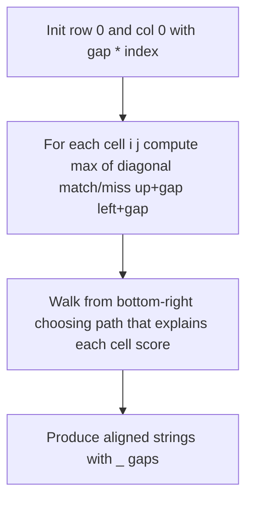

# Needleman-Wunsch Algorithm

This document explains the global pairwise sequence alignment algorithm implemented in **nw-concurrency**.

## What is global alignment?

**Global alignment** finds the best way to align two sequences over their entire length, allowing gaps (represented as `_`) where one sequence has a character and the other does not. This differs from **local alignment** (e.g. Smith-Waterman), which finds the best matching substring within longer sequences.

The [Needleman-Wunsch algorithm](https://en.wikipedia.org/wiki/Needleman%E2%80%93Wunsch_algorithm) (1970) uses dynamic programming to compute an optimal alignment in `O(m × n)` time, where `m` and `n` are the sequence lengths.

## Pipeline overview



In code, these steps map to:

1. **Initialize borders** — [`MatrixPopulatorDecorator`](../concurrent-needle-wunsch/NeedlemanWunschAligner/src/com/codigofacilito/needlewunsch/controller/MatrixPopulatorDecorator.java)
2. **Fill matrix** — [`SequentialMatrixDecorator`](../concurrent-needle-wunsch/NeedlemanWunschAligner/src/com/codigofacilito/needlewunsch/controller/impl/SequentialMatrixDecorator.java) or [`ConcurrentMatrixDecorator`](../concurrent-needle-wunsch/NeedlemanWunschAligner/src/com/codigofacilito/needlewunsch/controller/impl/ConcurrentMatrixDecorator.java)
3. **Backtrack** — [`BacktrackSequenceAligner`](../concurrent-needle-wunsch/NeedlemanWunschAligner/src/com/codigofacilito/needlewunsch/controller/impl/BacktrackSequenceAligner.java)
4. **Print** — [`AlignedSequencesPrinter`](../concurrent-needle-wunsch/NeedlemanWunschAligner/src/com/codigofacilito/needlewunsch/view/AlignedSequencesPrinter.java) implementations

## Scoring scheme

Default scores (configurable via `application.properties`):

| Parameter | Property key | Default |
|-----------|--------------|---------|
| Gap penalty | `matrix.score.gap` | `-2` |
| Match reward | `matrix.score.match` | `+1` |
| Mismatch penalty | `matrix.score.miss` | `-1` |

For each cell `(i, j)` where `i` and `j` index characters in sequence A and B:

```
score[i][j] = max(
    score[i-1][j-1] + match_or_miss(A[i-1], B[j-1]),
    score[i-1][j]   + gap,
    score[i][j-1]   + gap
)
```

Where `match_or_miss` returns `match` if the characters are equal, otherwise `miss`.

## Worked example

Sequences: **A = `ACG`**, **B = `AG`**

Scoring: gap = -2, match = +1, miss = -1

### Step 1: Initialize borders

Row 0 and column 0 are filled with `gap × index`:

```
       _   A   G
    _   0  -2  -4
    A  -2   ?   ?
    C  -4   ?   ?
    G  -6   ?   ?
```

### Step 2: Fill the matrix

| Cell | Diagonal | Up | Left | Chosen |
|------|----------|----|------|--------|
| (1,1) A↔A | 0+1=1 | -2+(-2)=-4 | -2+(-2)=-4 | **1** |
| (1,2) A↔G | 0+(-1)=-1 | 1+(-2)=-1 | -4+(-2)=-6 | **-1** |
| (2,1) C↔A | -2+(-1)=-3 | -4+(-2)=-6 | 1+(-2)=-1 | **-1** |
| (2,2) C↔G | 1+(-1)=0 | -1+(-2)=-3 | -1+(-2)=-3 | **0** |
| (3,1) G↔A | -4+(-1)=-5 | -6+(-2)=-8 | -1+(-2)=-3 | **-3** |
| (3,2) G↔G | -1+1=0 | -3+(-2)=-5 | 0+(-2)=-2 | **0** |

Final matrix:

```
       _   A   G
    _   0  -2  -4
    A  -2   1  -1
    C  -4  -1   0
    G  -6  -3   0
```

### Step 3: Backtrack from (3, 2)

Starting at the bottom-right cell, the aligner chooses the move that explains how that cell's score was derived:

1. **(3,2)** G↔G — diagonal (match) → `G` / `G`
2. **(2,1)** C↔A — diagonal (mismatch) → `C` / `A`
3. **(1,1)** A↔A — diagonal (match) → `A` / `A`

### Step 4: Aligned output

```
A C G
A _ G
```

Gap character `_` indicates that sequence B has no character at that position.

## Backtracking rules

[`BacktrackSequenceAligner`](../concurrent-needle-wunsch/NeedlemanWunschAligner/src/com/codigofacilito/needlewunsch/controller/impl/BacktrackSequenceAligner.java) walks from `(lenA, lenB)` toward `(0, 0)`:

1. If moving diagonally reproduces the current cell score → align both characters
2. Else if moving up (gap in B) reproduces the score → align A's character with `_`
3. Else → align `_` with B's character (gap in A)

The walk stops when both indices reach 0. The aligned strings are built in reverse and returned as an `AlignedSequences` record.

## Output

Aligned sequences are written via the backtracker printer (default: `result.txt`):

```
Aligned sequence A: ACG
Aligned sequence B: A_G
```

Optionally, the full scoring matrix can be dumped when `matrix.printer.enabled=true` (default file: `matrix.txt`).

## Further reading

- [Needleman-Wunsch on Wikipedia](https://en.wikipedia.org/wiki/Needleman%E2%80%93Wunsch_algorithm)
- [Original paper (1970)](https://doi.org/10.1016/0022-2836(70)90057-4) — Needleman & Wunsch, *Journal of Molecular Biology*

## Related documentation

- [Architecture](architecture.md) — how the algorithm fits into the module structure
- [Concurrency](concurrency.md) — parallel matrix fill strategy
- [Configuration](configuration.md) — scoring and output properties
