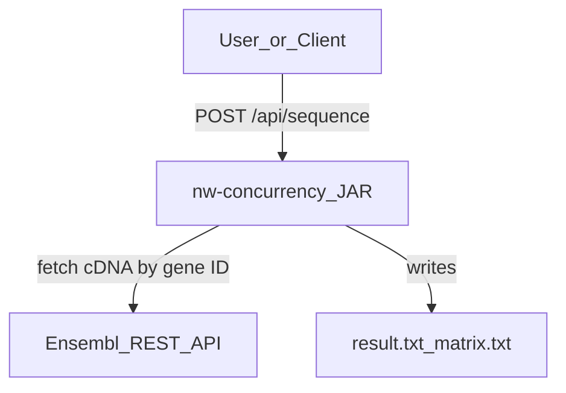
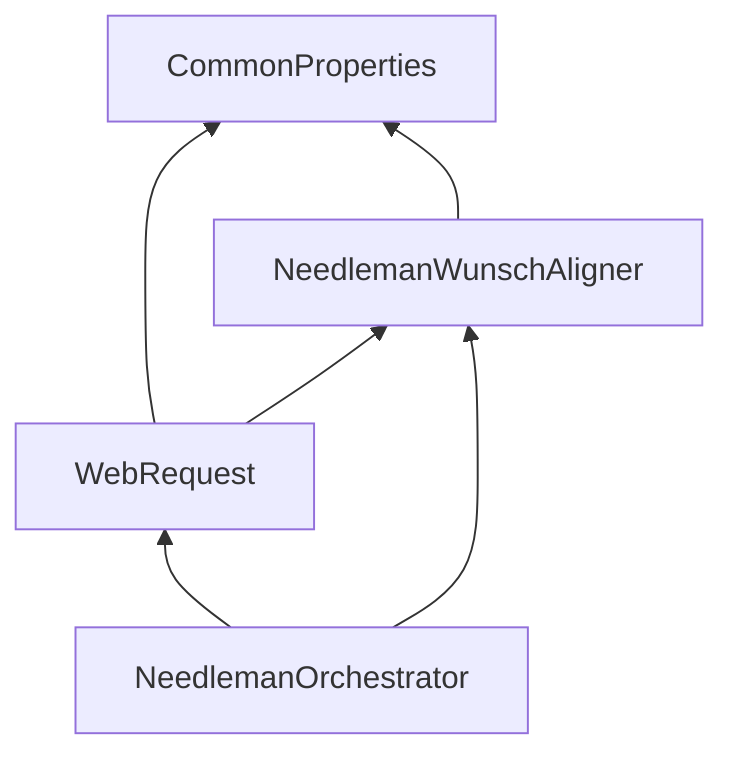
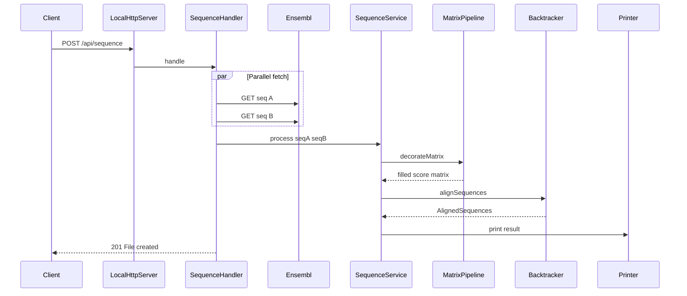
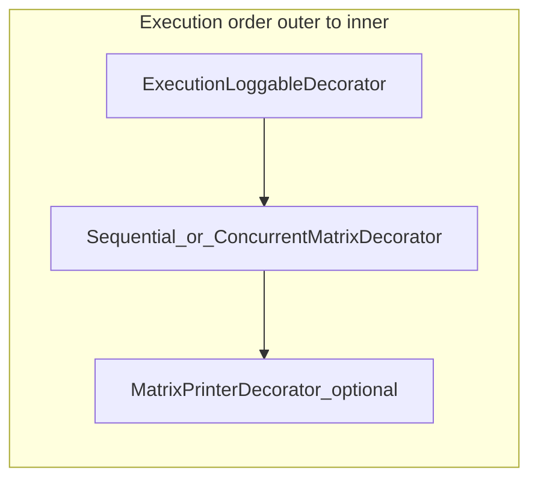
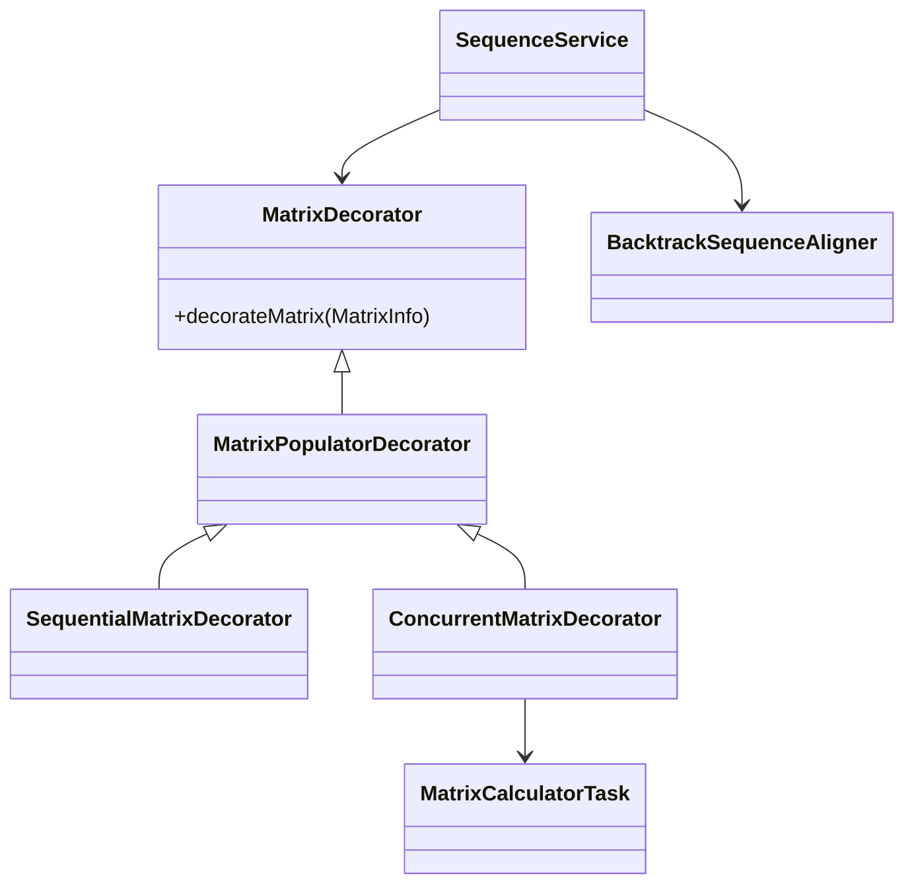

# Architecture

This document describes the structure, modules, and design patterns of **nw-concurrency**.

## System context

The application is a standalone JAR that exposes a local HTTP endpoint. On each request it fetches two DNA sequences from the Ensembl REST API, runs Needleman-Wunsch alignment, and writes results to the file system or console.

## Module dependencies

The project uses the Java Platform Module System (JPMS) with four IntelliJ modules under `concurrent-needle-wunsch/`:

| Module | Path | Responsibility |
|--------|------|----------------|
| **CommonProperties** | `concurrent-needle-wunsch/CommonProperties/` | Loads `application.properties` and `request.properties`; typed configuration models |
| **NeedlemanWunschAligner** | `concurrent-needle-wunsch/NeedlemanWunschAligner/` | Needleman-Wunsch algorithm, decorator pipeline, concurrency, output printers |
| **WebRequest** | `concurrent-needle-wunsch/WebRequest/` | Ensembl HTTP client, local HTTP server, request handler |
| **NeedlemanOrchestrator** | `concurrent-needle-wunsch/NeedlemanOrchestrator/` | Application entry point; starts the HTTP server |

### Package map

**CommonProperties**

- `com.codigofacilito.common.props.reader` — `GlobalProperties`, `AbstractPropertiesReader`
- `com.codigofacilito.common.props.reader.req` — `RequestProperties`
- `com.codigofacilito.common.props.model` — matrix, scoring, concurrency, printer config
- `com.codigofacilito.common.props.model.req` — `WebRequestProperties`

**NeedlemanWunschAligner**

- `com.codigofacilito.needlewunsch.models` — `InputData`, `MatrixInfo`, `AlignedSequences`
- `com.codigofacilito.needlewunsch.controller` — `MatrixDecorator`, `SequenceAligner`
- `com.codigofacilito.needlewunsch.controller.impl` — decorators, `BacktrackSequenceAligner`
- `com.codigofacilito.needlewunsch.controller.factory` — `MatrixDecoratorFactory`, `AlignedSequencesPrinterFactory`
- `com.codigofacilito.needlewunsch.concurrency` — `MatrixCalculatorTask`
- `com.codigofacilito.needlewunsch.view` — aligned sequence and matrix printers

**WebRequest**

- `com.codigofacilito.sequence.api.server` — `LocalHttpServer`
- `com.codigofacilito.sequence.api.handler` — `SequenceHandler`
- `com.codigofacilito.sequence.api.client` — `SequenceWebClient`, `SequenceWebClientImpl`
- `com.codigofacilito.sequence.api.service` — `SequenceService`, `SequenceServiceImpl`

**NeedlemanOrchestrator**

- `com.codigofacilito.needleman.orchestrator` — `Main`

## End-to-end request flow

The documented runtime path starts at `NeedlemanOrchestrator.Main`, which binds an HTTP server on port 8080.

Key classes:

- [`LocalHttpServer`](../concurrent-needle-wunsch/WebRequest/src/com/codigofacilito/sequence/api/server/LocalHttpServer.java) — creates `HttpServer` on port 8080, context `/api/sequence`
- [`SequenceHandler`](../concurrent-needle-wunsch/WebRequest/src/com/codigofacilito/sequence/api/handler/SequenceHandler.java) — fetches sequences in parallel, delegates to the alignment service
- [`SequenceServiceImpl`](../concurrent-needle-wunsch/WebRequest/src/com/codigofacilito/sequence/api/service/SequenceServiceImpl.java) — builds the matrix, runs the decorator pipeline, backtracks, prints

## Matrix decorator pipeline

The scoring matrix is populated through a **Decorator** chain assembled by [`MatrixDecoratorFactory`](../concurrent-needle-wunsch/NeedlemanWunschAligner/src/com/codigofacilito/needlewunsch/controller/factory/MatrixDecoratorFactory.java). The factory builds **innermost-first** (printer → populator → logger), so at runtime execution flows **outermost → innermost**:

Each decorator performs its work, then optionally delegates to the next decorator via `next().decorateMatrix(matrixInfo)`.

| Property | Decorator | Effect |
|----------|-----------|--------|
| `matrix.log-exec-time=true` | `ExecutionLoggableDecorator` | Times matrix population and logs duration in ms |
| `matrix.concurrency.enabled=true` | `ConcurrentMatrixDecorator` | Fills matrix using ForkJoinPool |
| `matrix.concurrency.enabled=false` | `SequentialMatrixDecorator` | Fills matrix with nested loops |
| `matrix.printer.enabled=true` | `MatrixConsolePrinterMatrixDecorator` or `MatrixFilePrinterMatrixDecorator` | Dumps the full scoring matrix |

Both `SequentialMatrixDecorator` and `ConcurrentMatrixDecorator` extend `MatrixPopulatorDecorator`, which initializes row 0 and column 0 with cumulative gap scores before the inner cells are computed.

## Key components

| Component | Role |
|-----------|------|
| `InputData` | Record holding two sequences and gap/match/miss scores |
| `MatrixInfo` | Builder that creates the `(lenA+1) × (lenB+1)` score matrix |
| `MatrixPopulatorDecorator` | Initializes first row and column with gap penalties |
| `SequentialMatrixDecorator` / `ConcurrentMatrixDecorator` | Fills remaining matrix cells |
| `MatrixCalculatorTask` | `RecursiveTask` that splits row ranges for ForkJoin |
| `BacktrackSequenceAligner` | Walks the matrix from bottom-right to produce aligned strings |
| `AlignedSequencesPrinter` | Writes aligned output to console or file |

## Design patterns

| Pattern | Where used |
|---------|------------|
| **Decorator** | Matrix pipeline (`MatrixDecorator` hierarchy) |
| **Factory** | `MatrixDecoratorFactory`, `AlignedSequencesPrinterFactory` |
| **Singleton** | `GlobalProperties.getInstance()`, `RequestProperties.getInstance()` |
| **Builder** | `MatrixInfo.builder()`, property model builders |
| **Strategy** | Sequential vs concurrent matrix population selected by config |

## Entry points

| Entry point | Class | Usage |
|-------------|-------|-------|
| Primary (JAR) | `NeedlemanOrchestrator.Main` | `java -jar NeedlemanOrchestrator.jar` — starts HTTP server |
| Secondary (IDE) | `NeedlemanWunschAligner.Main` | Hardcoded sequences; no `String[] args` — for module testing only |

## Related documentation

- [Algorithm](algorithm.md) — Needleman-Wunsch steps and scoring
- [Concurrency](concurrency.md) — ForkJoin and HTTP parallel fetch details
- [API](api.md) — HTTP endpoint contract
- [Configuration](configuration.md) — property reference
