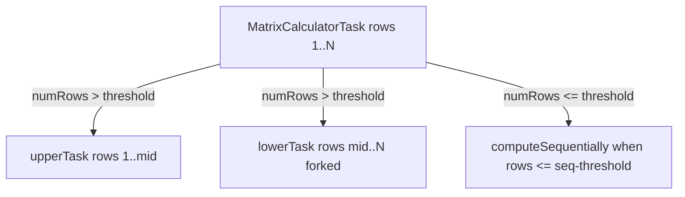
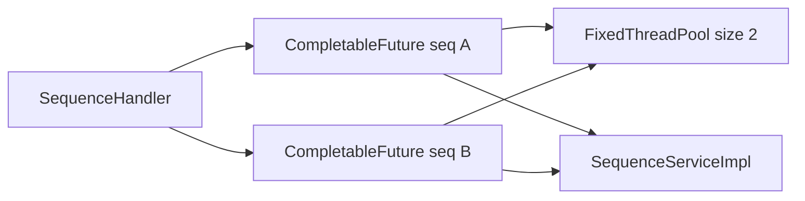

# Concurrency

**nw-concurrency** demonstrates two concurrency patterns: CPU-bound parallel matrix computation (ForkJoin) and I/O-bound parallel HTTP sequence fetching (CompletableFuture).

## Overview

| Layer | Mechanism | Class | Config |
|-------|-----------|-------|--------|
| Matrix computation | ForkJoinPool + RecursiveTask | `MatrixCalculatorTask` | `matrix.concurrency.*` |
| HTTP sequence fetch | FixedThreadPool + CompletableFuture | `SequenceHandler` | Hardcoded pool size of 2 |

Backtracking and border initialization are always sequential.

## Matrix computation (ForkJoin)

When `matrix.concurrency.enabled=true`, [`ConcurrentMatrixDecorator`](../concurrent-needle-wunsch/NeedlemanWunschAligner/src/com/codigofacilito/needlewunsch/controller/impl/ConcurrentMatrixDecorator.java) uses a `ForkJoinPool` to invoke [`MatrixCalculatorTask`](../concurrent-needle-wunsch/NeedlemanWunschAligner/src/com/codigofacilito/needlewunsch/concurrency/MatrixCalculatorTask.java).

### Prerequisites

Before parallel work begins, [`MatrixPopulatorDecorator`](../concurrent-needle-wunsch/NeedlemanWunschAligner/src/com/codigofacilito/needlewunsch/controller/MatrixPopulatorDecorator.java) sequentially initializes row 0 and column 0. Each inner cell `(i, j)` depends only on `(i-1, j-1)`, `(i-1, j)`, and `(i, j-1)`, so **rows can be computed in parallel** once borders are set.

### Recursive row splitting



Algorithm in `MatrixCalculatorTask.compute()`:

1. If `endRow - startRow <= sequentialThreshold` → compute all cells in that row range with nested loops
2. Otherwise → split at `midRow`, fork the lower half, compute the upper half, then join the lower half

The fork/join pattern (`lowerTask.fork(); upperTask.compute(); lowerTask.join()`) keeps one subtask on the current thread while the other runs in the pool.

### Configuration

| Property | Default | Description |
|----------|---------|-------------|
| `matrix.concurrency.enabled` | `false` | Enable ForkJoin matrix fill |
| `matrix.concurrency.pool-size` | CPU count | ForkJoinPool parallelism |
| `matrix.concurrency.seq-threshold` | `20` | Row count below which work runs sequentially |

### When to enable concurrency

ForkJoin adds overhead from task creation and pool management. Concurrency is most beneficial for **long sequences** that produce large matrices. For short sequences, sequential mode is typically faster.

Use `matrix.log-exec-time=true` to compare execution times:

```properties
matrix.concurrency.enabled=false
matrix.log-exec-time=true
```

Run alignment, note the duration, then toggle `matrix.concurrency.enabled=true` and compare.

### What stays sequential

- Border initialization (row 0, column 0)
- Backtracking (`BacktrackSequenceAligner`)
- Matrix and result printing

## HTTP sequence fetch (CompletableFuture)

[`SequenceHandler`](../concurrent-needle-wunsch/WebRequest/src/com/codigofacilito/sequence/api/handler/SequenceHandler.java) fetches two sequences from Ensembl in parallel before alignment begins.



Flow:

1. Read `seq-a-id` and `seq-b-id` from `request.properties`
2. Create a `FixedThreadPool` with 2 threads (one per sequence)
3. Submit two `CompletableFuture.supplyAsync` tasks that call `SequenceWebClientImpl.getSequence`
4. Resolve both futures with `.get()` before calling `SequenceServiceImpl.process`

This is **I/O-bound** concurrency: the two HTTP calls to Ensembl overlap, reducing total wait time compared to sequential fetching.

### Not configurable

The HTTP thread pool size is hardcoded to 2 in `SequenceHandler`. It matches the fixed number of sequences fetched per request.

## Comparison

| Aspect | Matrix (ForkJoin) | HTTP (CompletableFuture) |
|--------|-------------------|--------------------------|
| Work type | CPU-bound | I/O-bound |
| Configurable | Yes (`application.properties`) | No (hardcoded pool of 2) |
| Parallelism unit | Row ranges in score matrix | One future per sequence |
| Framework | `ForkJoinPool`, `RecursiveTask` | `ExecutorService`, `CompletableFuture` |

## Related documentation

- [Architecture](architecture.md) — decorator pipeline and module structure
- [Algorithm](algorithm.md) — what the matrix computation does
- [Configuration](configuration.md) — concurrency property reference
