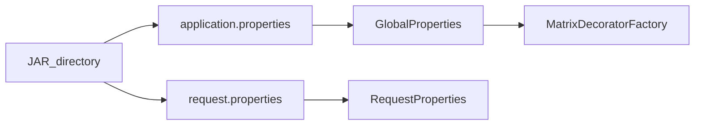

# Configuration

This document describes the property files used by **nw-concurrency** and where to place them.

## Property files

Two files are loaded at runtime from the directory containing the compiled classes or JAR:

| File | Loaded by | Purpose |
|------|-----------|---------|
| `application.properties` | `GlobalProperties` | Matrix scoring, concurrency, printers, logging |
| `request.properties` | `RequestProperties` | Ensembl URL and sequence IDs |

### Where to place files

| Run mode | Location |
|----------|----------|
| JAR | Same directory as `NeedlemanOrchestrator.jar` |
| IntelliJ IDE | `out/production/<module>/` for the module that loads the properties |

[`AbstractPropertiesReader`](../concurrent-needle-wunsch/CommonProperties/src/com/codigofacilito/common/props/reader/AbstractPropertiesReader.java) resolves the directory from the code source location of the properties reader class.

All properties are **optional** — defaults apply when a key is missing.

## Configuration flow



## application.properties

Controls alignment behavior, matrix output, and concurrency.

### Sample file

```properties
backtracker.printer.enabled=true
backtracker.printer.output=FILE
backtracker.printer.filename=result.txt
matrix.printer.enabled=false
matrix.printer.output=FILE
matrix.printer.filename=matrix.txt
matrix.concurrency.enabled=true
# matrix.concurrency.pool-size=2
matrix.concurrency.seq-threshold=20
matrix.score.gap=-2
matrix.score.match=1
matrix.score.miss=-1
matrix.log-exec-time=true
```

### Property reference

#### Backtracker (aligned sequence output)

| Key | Default | Values | Description |
|-----|---------|--------|-------------|
| `backtracker.printer.enabled` | `true` | `true`, `false` | Write aligned sequences after backtracking |
| `backtracker.printer.output` | `FILE` | `FILE`, `CONSOLE` | Output destination |
| `backtracker.printer.filename` | `result.txt` | any path | File path when output is `FILE` |

#### Matrix printer (scoring matrix dump)

| Key | Default | Values | Description |
|-----|---------|--------|-------------|
| `matrix.printer.enabled` | `false` | `true`, `false` | Dump the full scoring matrix after computation |
| `matrix.printer.output` | `FILE` | `FILE`, `CONSOLE` | Output destination |
| `matrix.printer.filename` | `matrix.txt` | any path | File path when output is `FILE` |

#### Matrix concurrency

| Key | Default | Values | Description |
|-----|---------|--------|-------------|
| `matrix.concurrency.enabled` | `false` | `true`, `false` | Use ForkJoin for matrix fill |
| `matrix.concurrency.pool-size` | CPU count | positive integer | ForkJoinPool parallelism |
| `matrix.concurrency.seq-threshold` | `20` | positive integer | Row count below which computation runs sequentially |

#### Matrix scoring

| Key | Default | Description |
|-----|---------|-------------|
| `matrix.score.gap` | `-2` | Penalty for inserting a gap |
| `matrix.score.match` | `1` | Reward for matching characters |
| `matrix.score.miss` | `-1` | Penalty for mismatching characters |

#### Logging

| Key | Default | Description |
|-----|---------|-------------|
| `matrix.log-exec-time` | `true` | Log matrix population duration in milliseconds |

## request.properties

Controls Ensembl sequence fetching for the HTTP workflow.

### Sample file

```properties
req.url=https://rest.ensembl.org/sequence/id/%s?type=cdna;content-type=application/json
req.seq-a-id=ENSG00000239615
req.seq-b-id=ENSG00000239617
```

### Property reference

| Key | Default | Description |
|-----|---------|-------------|
| `req.url` | `https://rest.ensembl.org/sequence/id/%s?type=cdna;content-type=application/json` | Ensembl URL template; `%s` is replaced with gene ID |
| `req.seq-a-id` | `ENSG00000239615` | Ensembl gene ID for sequence A |
| `req.seq-b-id` | `ENSG00000239617` | Ensembl gene ID for sequence B |

## Output files

When printers are enabled with `output=FILE`:

| File | Produced by | Contents |
|------|-------------|----------|
| `result.txt` | Backtracker printer | Two globally aligned sequences with `_` gap characters |
| `matrix.txt` | Matrix printer | Full `(lenA+1) × (lenB+1)` scoring matrix |

## Tuning concurrency

To compare sequential vs concurrent matrix fill:

1. Set `matrix.log-exec-time=true`
2. Run with `matrix.concurrency.enabled=false` and note the logged duration
3. Set `matrix.concurrency.enabled=true` and compare

For large sequences, try adjusting `matrix.concurrency.pool-size` and `matrix.concurrency.seq-threshold`. Lower thresholds create more ForkJoin splits; higher thresholds reduce task overhead.

## Related documentation

- [API](api.md) — how `request.properties` drives the HTTP endpoint
- [Concurrency](concurrency.md) — what the concurrency properties control
- [Architecture](architecture.md) — how properties feed the decorator factory
